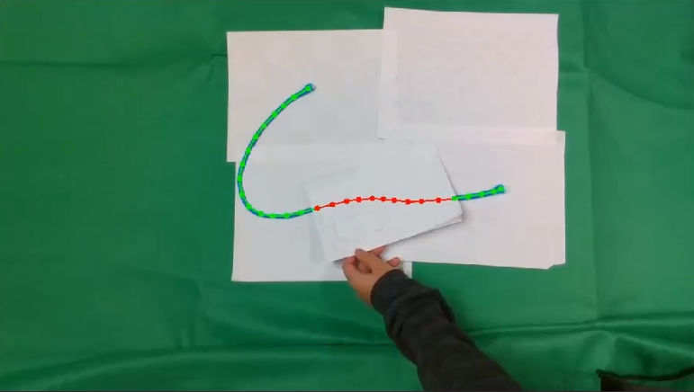

# TrackDLO ROS Package

This is the TrackDLO ROS package for tracking deformable linear objects under occlusion. The TrackDLO algorithm solves the problem of real-time state estimation of Deformable Linear Objects (DLOs), like wires and ropes, under occlusion. The goal of DLO state estimation under occlusion is to extract the structure of the DLO from a noisy or incomplete set of measurements. TrackDLO accounts for directional rigidity to infer the motion of the occluded part of the object from the motion of the visible part. TrackDLO also introduces the notion of a geodesic proximity metric for linking a set of nodes which represent the configuration of the DLO. This modified proximity metric not only improves tracking under occlusion, but also mitigates tracking entanglement for cases of self-occlusion. TrackDLO performs robust wire state estimation under known confounders like partial occlusion by other objects, tip occlusion, and self-occlusion.

<p align="center">
  
</p>

----------------------
## C++:

### Important:
1. Run ```catkin build``` to get the executable file. Make sure to do this every time after modifying the cpp files!
2. Use the boolean ```use_eval_rope``` in ```tracking_node.cpp``` to switch between regular rope and marker rope.
3. To use the interactive OpenCV window to create occlusions manually, run ```rosrun trackdlo opencv_interactive.py``` alongside with the camera node and the tracking node.

### To test TrackDLO with RGB-D camera stream:
1. Run ```roslaunch trackdlo realsense_node.launch```. This will bring up the rviz window with color image, mask, and tracking result (2D and 3D) visualized.
2. Open a new terminal and run ```rosrun trackdlo trackdlo_node```. This will start the tracking algorithm and publish all results.

### To test TrackDLO with recorded bag files:

1. Download the bag files from [here](https://drive.google.com/drive/folders/1AwMXysdzRQLz7w8umj66rrKa-Bh0XlVJ?usp=share_link) and place them in your ROS workspace.
2. Open a new terminal and run ```roslaunch trackdlo replay_bag.launch```.
3. In another terminal, run ```rosrun trackdlo trackdlo_node```. This will start the tracking algorithm.
4. Finally, open another ternimal and run ```rosbag play <name_of_the_bag_file>.bag```. This will replay the bag file and all results will be published in rviz.

----------------------
## Python:

### To test TrackDLO with RGB-D camera stream:
1. Run ```roslaunch trackdlo realsense_node.launch```. This will bring up the rviz window with color image, mask, and tracking result (2D and 3D) visualized.
2. Open a new terminal and run ```rosrun trackdlo trackdlo.py```. This will start the tracking algorithm and publish all results.

### To test TrackDLO with ROS bag files:
1. Download the bag files from [here](https://drive.google.com/drive/folders/1AwMXysdzRQLz7w8umj66rrKa-Bh0XlVJ?usp=share_link) and place them in your ROS workspace.
2. Run ```roslaunch trackdlo replay_bag.launch```. This will bring up the rviz window with color image, mask, and tracking result (2D and 3D) visualized. The RGB-D camera node will not be started.
3. Open a new terminal and run ```rosrun trackdlo trackdlo.py```. This will start the tracking algorithm and the results will be published after the bag file starts running.
4. Open a new terminal and run ```rosbag play <name_of_the_bag_file>.bag```. This will replay the bag file.
