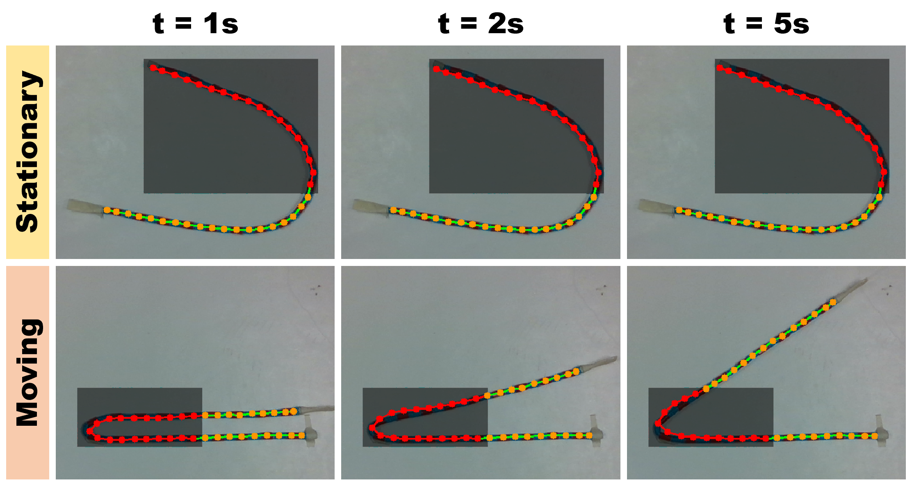

# TrackDLO ROS Package

This is the implementation of *TrackDLO: Tracking Deformable Linear Objects Under Occlusion with Motion Coherence* (under submission) by Jingyi Xiang, Holly Dinkel, Harry Zhao, Naixiang Gao, Brian Coltin, Trey Smith, and Timothy Bretl. We provide the implementation in both Python and C++. We also provide data for benchmarking to other deformable linear object tracking algorithms.

## Abstract
The TrackDLO algorithm estimates the state of Deformable Linear Objects (DLOs), such as wire and rope, under occlusion. State estimation under occlusion extracts the structure of an object from a noisy or incomplete set of measurements over time. TrackDLO uses Extended Coherent Point Drift with modified membership probability to extrapolate the motion of the occluded part of the object from the motion of the visible part. TrackDLO also uses a non-Gaussian kernel over the standard Gaussian kernel for more consistent and reasonable velocity field extrapolation. Furthermore, TrackDLO incorporates a modified distance proximity metric for linking a set of nodes which represent the configuration of the DLO. TrackDLO performs robust wire state estimation under known tracking confounders like partial occlusion by other objects, tip occlusion, and self-occlusion.

<p align="center">
  
</p>


## C++:

Instructions for running the C++ implementation of TrackDLO are below.

### Test TrackDLO with a RGB-D Camera Stream:
1. Run ```roslaunch trackdlo realsense_node.launch```. This will bring up an RViz window visualizing the color image, mask, and tracking result (in both the image and a 3D pointcloud).
2. Open a new terminal and run ```rosrun trackdlo trackdlo_node```. This will start the TrackDLO algorithm and publish messages containing the estimated node positions defining the object shape.

### Test TrackDLO with Recorded ROS Bag Data:
1. Download the bag files from [here](https://drive.google.com/drive/folders/1AwMXysdzRQLz7w8umj66rrKa-Bh0XlVJ?usp=share_link) and place them in your ROS workspace.
2. Open a new terminal and run ```roslaunch trackdlo replay_bag.launch```.
3. In another terminal, run ```rosrun trackdlo trackdlo_node```. This will start the tracking algorithm.
4. Finally, open another ternimal and run ```rosbag play <name_of_the_bag_file>.bag```. This will replay the bag file and all results will be published in rviz.

### Important:
1. Run ```catkin build``` to create the executable file. Do this every time after modifying any of the .cpp files.
2. Set the boolean variable ```use_eval_rope``` in ```tracking_node.cpp``` to switch between regular rope and marker rope.
3. Run ```rosrun trackdlo opencv_interactive.py``` alongside with the camera node and the tracking node to user interactive OpenCV visualization to manually synthetically create occlusions.


## Python:

Instructions for running the Python implementation of TrackDLO are below.

### Test TrackDLO with a RGB-D Camera Stream:
1. Run ```roslaunch trackdlo realsense_node.launch```. This will bring up the rviz window with color image, mask, and tracking result (2D and 3D) visualized.
2. Open a new terminal and run ```rosrun trackdlo trackdlo.py```. This will start the tracking algorithm and publish all results.

### Test TrackDLO with Recorded ROS Bag Data:
1. Download the bag files from [here](https://drive.google.com/drive/folders/1AwMXysdzRQLz7w8umj66rrKa-Bh0XlVJ?usp=share_link) and place them in your ROS workspace.
2. Run ```roslaunch trackdlo replay_bag.launch```. This will bring up the rviz window with color image, mask, and tracking result (2D and 3D) visualized. The RGB-D camera node will not be started.
3. Open a new terminal and run ```rosrun trackdlo trackdlo.py```. This will start the tracking algorithm and the results will be published after the bag file starts running.
4. Open a new terminal and run ```rosbag play <name_of_the_bag_file>.bag```. This will replay the bag file.

## Data:

ROS bag data are provided for public use for testing TrackDLO [here](https://drive.google.com/drive/folders/1AwMXysdzRQLz7w8umj66rrKa-Bh0XlVJ?usp=sharing).