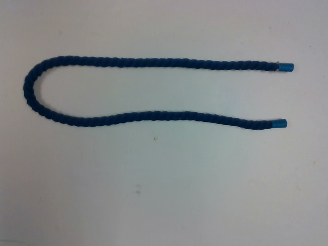
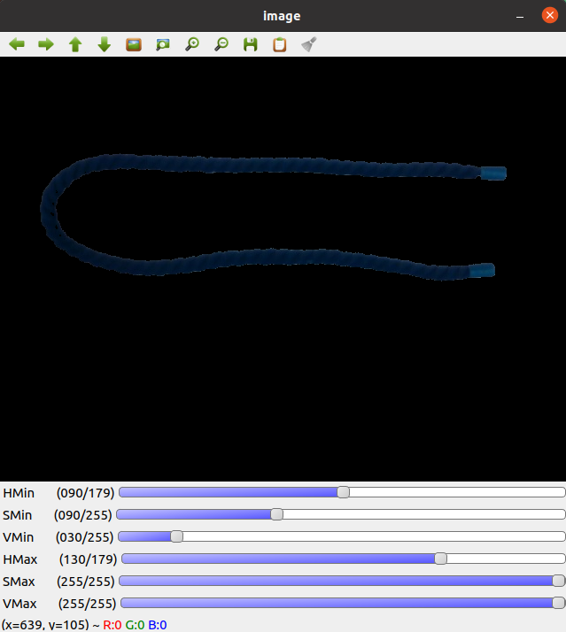

## Color-Segmenting Objects to Use with TrackDLO

TrackDLO uses color thresholding to obtain the DLO segmentation mask. The [`color_picker.py`](https://github.com/RMDLO/trackdlo/blob/master/utils/color_picker.py) script is provided to simplify tuning the color threshold values using a simple interface with a track bar. This document provides a tutorial of intended use for this script. 

First, save an image to use for color thresholding. We use an Intel RealSense d435 camera. The RealSense ROS package publishes raw RGB images to the `/camera/color/image_raw` topic. Raw `.png` images can be extracted from this topic using the [image_view](http://wiki.ros.org/image_view#image_view.2Fdiamondback.image_saver) ROS package:

Terminal 1:

```
roslaunch trackdlo realsense_node.launch
```

Terminal 2:

```
rosrun image_view image_saver image:=/camera/color/image_raw
```

This is an example of a rope image ([`rope.png`](https://github.com/RMDLO/trackdlo/blob/master/images/rope.png)) from our camera:

<p align="center">
  
</p>

Next, run the user interface (replace `images/rope.png` with the relative or full path to the image of the DLO).

```
cd /path/to/trackdlo/root/folder && python utils/color_picker.py images/rope.png
```

The user interface should appear as shown below. Use the track bars to tune the HSV lower and upper limits to segment the background.

<p align="center">
  
</p>

Once the HSV threshold values are determined with this tool, modify the default values according to the instructions below:
* Monochrome DLO: set the lower and upper HSV value ranges in the [`trackdlo.launch`](https://github.com/RMDLO/trackdlo/blob/master/launch/trackdlo.launch) file. 
* Multi-Colored DLO: set `multi_color_dlo` to `true` in [`trackdlo.launch`](https://github.com/RMDLO/trackdlo/blob/master/launch/trackdlo.launch), then modify the `color_thresholding` function in [`initialize.py`](https://github.com/RMDLO/trackdlo/blob/master/trackdlo/src/initialize.py) and [`trackdlo_node.cpp`](https://github.com/RMDLO/trackdlo/blob/master/trackdlo/src/trackdlo_node.cpp) to customize DLO segmentation.